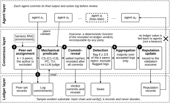

# Architecture

The prototype has three layers. Agents write action logs, the consensus layer decides which logs to
trust by re-checking them, and the ledger keeps a tamper-evident record of what was committed and
decided. The ledger stores and verifies records; it takes no decisions.

*Figure 1. Three layers and one batch validation round. Numbered markers follow the stages below.
PNG and PDF versions are in [`figures/`](../figures/).*

## Layers

**Agent layer** (`src/agents.py`, `src/gsm8k_logs.py`, `src/walking_skeleton.py`,
`src/adversaries.py`). Each agent produces a final output and an action log that records how it
got there: ordered reasoning steps, the tool operations they invoked, and which step yields the
final output. The log format is described in [schema.md](schema.md). In the reported runs the
agents are scripted: honest logs are mechanical transcriptions of GSM8K reference solutions, and
free-rider logs are built by fixed rules. `agents.py` also contains a model client for a live
Llama 3.1 8B path, which the reported runs do not use (see [experiments.md](experiments.md)).

**Consensus layer** (`src/consensus.py`, `src/validation.py`, `src/metrics.py`). Assigns
validators to each log, runs the mechanical validation predicate ([predicate.md](predicate.md)),
collects verdicts through commit–reveal, flags and excludes logs that a supermajority of their
validators reject, aggregates the remaining final outputs per task, and updates reputations.

**Ledger layer** (`src/sim_ledger.py`). A simulated, append-only, hash-chained ledger. Every
record is content-addressed with SHA-256 over RFC 8785 canonical JSON. It stores logs, peer-set
records, verdict commitments and reveals, verdict-set seals and reputation records, enforces the
commit-then-reveal phase boundary, and offers `verify()` to detect tampering anywhere in the
chain. It runs no node consensus (no leader election, block ordering or finality rule), and no
ledger value is given to agents as a coordination input, so it is not a randomness beacon.

## One batch validation round

`consensus.run_round` processes all committed logs of a batch in lockstep:

0. **Initial reputation.** Every agent not yet on the ledger starts at r₀ = 0.5.
1. **Log commitment.** Each log is committed through `agents.finalize_and_commit`; its identifier
   equals its content hash, so any later edit is detectable.
2. **Peer-set assignment.** For each log, the experiment harness's seeded random number generator
   (not the ledger) draws k = 3 validators from all agents except the log's author. The draw's
   seed is recorded on the ledger for audit only.
3. **Verdicts.** Each assigned validator calls `validation.validate_committed`, which re-checks the
   log's content hash and then runs the predicate on exactly the committed bytes. No language
   model is involved.
4. **Commit–reveal.** One global commit phase records a salted hash of every verdict; only after all
   commitments are in does one global reveal phase open. Each reveal must match its commitment.
   Aggregation refuses to run before the reveal phase.
5. **Detection.** A log is flagged when at least 2/3 of its assigned validators' revealed verdicts
   reject it (with k = 3: two or three rejections). Flagged logs are excluded from aggregation.
6. **Aggregation.** Per task, a reputation-weighted plurality over the final outputs of accepted
   logs only.
7. **Seal and reputation.** Each accepted or rejected log gets a seal over its verdict commitments,
   and its author's reputation is updated from the validation outcome: accept
   r′ = r + α(1 − r), reject r′ = r(1 − β), with α = 0.10, β = 0.30, bounded to
   [10⁻⁶, 1 − 10⁻⁶]. The update depends on the validation outcome, never on agreement with other
   agents' outputs.

Because the verdicts and the predicate are both recomputable from the ledger, any party can
re-derive every outcome offline; a false verdict is therefore detectable after the fact.

**What the reported runs do not exercise.** Each scenario is a single batch, so every author is
weighted at r₀ when aggregating: reputation is written to the ledger but never influences a
consensus value. All validators are honest, including free-rider agents when they are drawn into a
peer set, so every validator of a log returns the same verdict. Byzantine validators and
multi-round reputation feedback are future work.

## The comparison arm

The output-only arm (`metrics.baseline_consensus`) reads only each log's final output value. Per
task it takes the unweighted plurality over all final outputs and flags a log if and only if its
output differs from that plurality. It performs no validation operations. Both arms judge the same
committed logs, so their decisions can be compared log by log and task by task.
